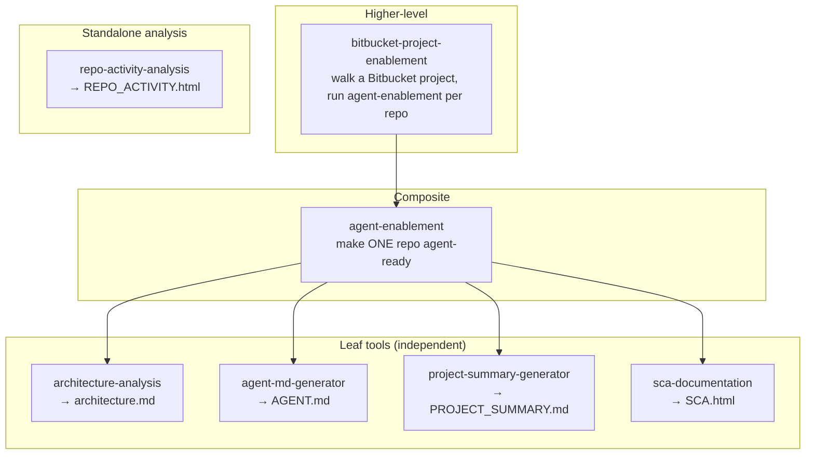

# agent-tools

A repo of composable **agent tools**. Each tool is a self-contained capability an
autonomous coding agent (Devin, Cursor, Claude Code, OpenHands, a CI job — or a human)
can run by reading its `SKILL.md` and following it. Tools can be used **independently**,
and higher-level tools **compose** lower ones.

## Layers



- **Leaf tools** do one thing and can run on any repo on their own.
- **Composite** tools combine leaf tools (`agent-enablement` = the leaf doc tools on one repo).
- **Higher-level** tools add orchestration (`bitbucket-project-enablement` = walk a
  project + run `agent-enablement` per repo + git + resumable state).
- **Standalone analysis** tools assess a repo rather than document it
  (`repo-activity-analysis`), so they're used on their own, not part of the enablement set.

## Tools

| Tool | Layer | Produces / does | Run independently? | Script |
|------|-------|-----------------|--------------------|--------|
| [`architecture-analysis`](architecture-analysis/SKILL.md) | leaf | `architecture.md` with Mermaid C4/component/ER/sequence diagrams | yes | `scripts/detect_stack.py` |
| [`agent-md-generator`](agent-md-generator/SKILL.md) | leaf | `AGENT.md` — real build/test/run/lint commands, conventions | yes | `scripts/detect_commands.py` |
| [`project-summary-generator`](project-summary-generator/SKILL.md) | leaf | `PROJECT_SUMMARY.md` — annotated file index + pinned deps | yes | `scripts/scan_inventory.py` |
| [`sca-documentation`](sca-documentation/SKILL.md) | leaf | `SCA.html` — searchable, collapsible dependency tree + version-conflict flags | yes | `scripts/generate_sca.py` |
| [`agent-enablement`](agent-enablement/SKILL.md) | composite | all of the above on one checked-out repo | yes (one repo) | — |
| [`bitbucket-project-enablement`](bitbucket-project-enablement/SKILL.md) | higher-level | walks a Bitbucket DC project, runs `agent-enablement` per repo, pushes `feature/agent-enablement` | yes (whole project) | `scripts/enable_project.py` |
| [`repo-activity-analysis`](repo-activity-analysis/SKILL.md) | standalone | `REPO_ACTIVITY.html` + JSON — contribution-health scorecard (liveness, velocity, trajectory, bus factor, churn, cadence) from pure git history | yes | `scripts/analyze_activity.py` |

Each leaf tool ships its **own** detector, specialized to what its document needs
(structure / commands / inventory) — so the tools stay independent and there's no
shared dependency between peers. `repo-activity-analysis` is a standalone *assessment*
(not part of the enablement doc set), and works on any git clone regardless of host.

## Conventions

Every tool is a top-level folder with:

```
<tool>/
├── SKILL.md          # what it does, when to use, how — its runbook (also a valid skill)
├── scripts/          # optional: standard-library Python helpers (no pip install)
└── references/       # optional: templates and per-stack guidance
```

`SKILL.md` is written so an agent can "read and follow" it directly; the frontmatter
`description` also makes it work as an auto-triggered skill in Claude Code / Cowork.

## Using a tool independently

Run any leaf tool's detector from the repo root, then follow its `SKILL.md`:

```bash
# Architecture only
python3 architecture-analysis/scripts/detect_stack.py /path/to/repo
# AGENT.md only
python3 agent-md-generator/scripts/detect_commands.py /path/to/repo
# PROJECT_SUMMARY only
python3 project-summary-generator/scripts/scan_inventory.py /path/to/repo
# Dependency-tree SCA report (Java/Maven, Node, or Python)
python3 sca-documentation/scripts/generate_sca.py /path/to/repo   # writes <repo>/SCA.html
# Contribution-health report (any git clone, any host)
python3 repo-activity-analysis/scripts/analyze_activity.py /path/to/repo  # writes <repo>/REPO_ACTIVITY.html
```

The architecture/agent/summary detectors handle **ReactJS, Angular, Java Spring Boot,
and Python** (with an `unknown` fallback) and need only Python 3 + the standard
library. `sca-documentation` covers **Java/Maven, Node, and Python**; the HTML render
is standard-library Python, but producing the tree runs the ecosystem's own command
(`mvn` / `npm` / `pipdeptree`), so those toolchains must be present and dependencies
resolved.

## The Bitbucket sweep (higher-level)

```bash
export BITBUCKET_URL=https://bitbucket.mycorp.com   # Bitbucket Data Center, no trailing /
export BITBUCKET_TOKEN=•••                           # HTTP access token, repo read/write
export BITBUCKET_PROJECT=PLATFORM                    # project key
# export BITBUCKET_WORKDIR=./.agent-enablement-work  # optional: clones + state file

cd bitbucket-project-enablement
python3 scripts/enable_project.py config   # confirm scope (token redacted)
python3 scripts/enable_project.py init     # list repos + build resumable state
# then loop: next → prepare <slug> → run agent-enablement → finalize <slug>
python3 scripts/enable_project.py status   # progress / resume report
```

Full runbook: [`bitbucket-project-enablement/SKILL.md`](bitbucket-project-enablement/SKILL.md).
It is resumable — if a sweep crashes, re-run `init` and continue; finished repos are
remembered (state at `$BITBUCKET_WORKDIR/state.json`). Targets Bitbucket **Data
Center** (REST 1.0); see `bitbucket-project-enablement/references/bitbucket-dc-api.md`
for the Cloud notes.

## Adding a new tool

- **New leaf tool** (e.g. a `SECURITY_NOTES.md` generator): create a folder with a
  `SKILL.md` (and its own `scripts/`/`references/` as needed).
- **Add it to the enablement set**: reference it from
  [`agent-enablement/SKILL.md`](agent-enablement/SKILL.md) — every caller, including
  the Bitbucket sweep, picks it up automatically because the orchestrator delegates to
  `agent-enablement` rather than to the leaf tools directly.

## Notes

- Scripts are standard-library Python — zero setup in any coding-agent VM.
- The detectors and the orchestrator's git/state machine were smoke-tested locally
  (stack detection, command/inventory extraction, the resumable state machine, and
  clone → branch → commit → push against a local origin).

## License

Licensed under the **Apache License 2.0** — free to use, modify, and distribute,
including in commercial software, with an explicit patent grant. See [`LICENSE`](LICENSE)
and [`NOTICE`](NOTICE).
