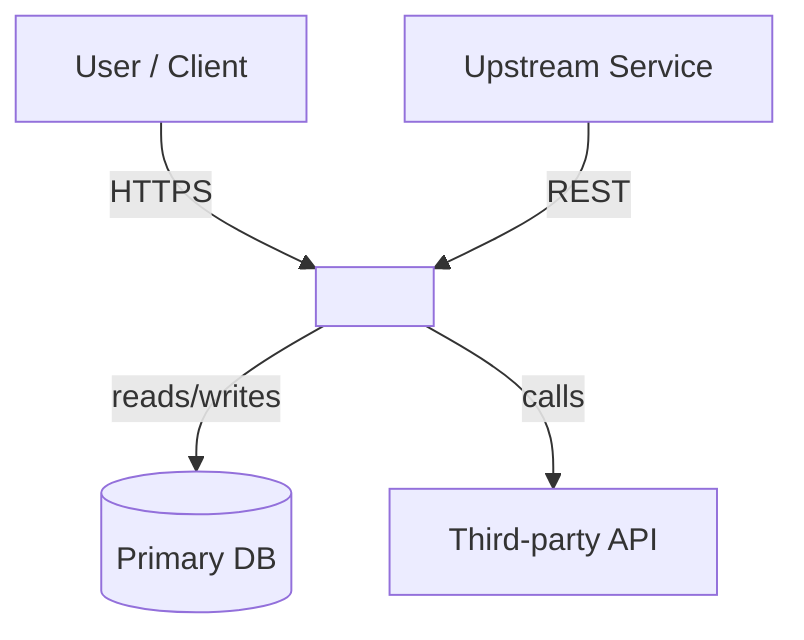
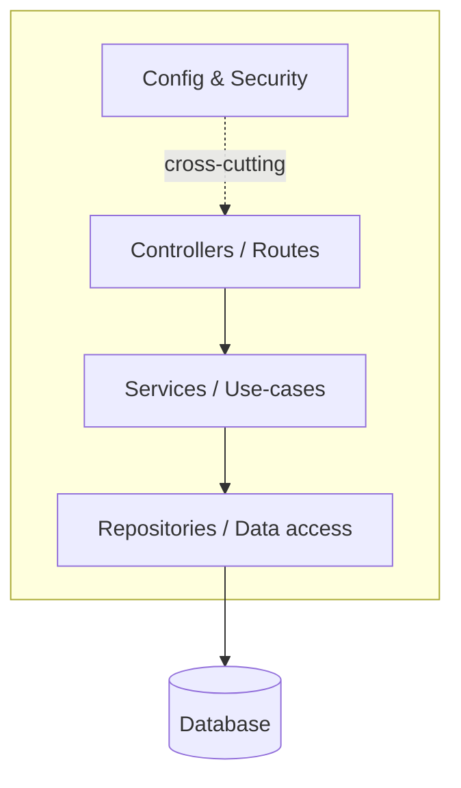
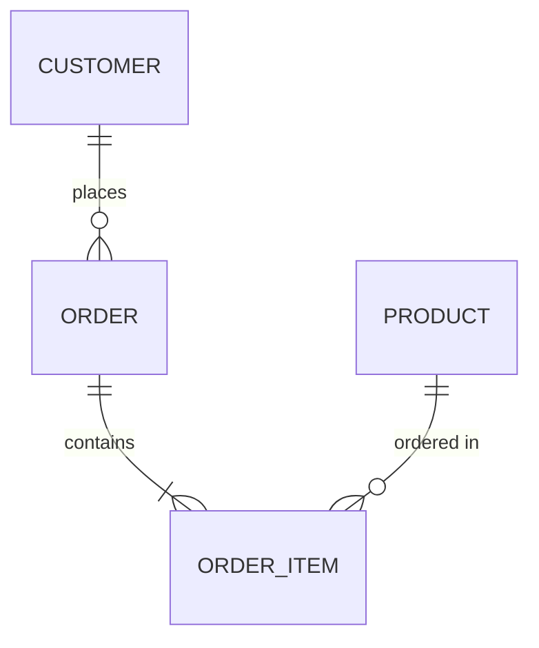
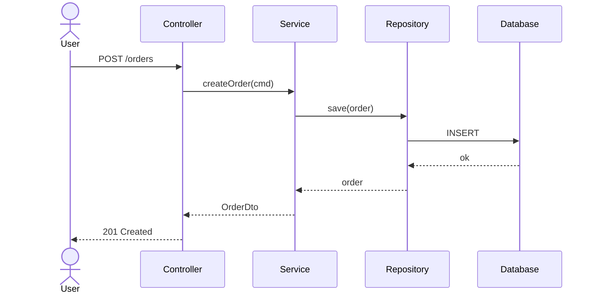

# architecture.md — required structure

Produce `architecture.md` with the sections below, in this order. Fill every
section from what you actually found in the code; delete a section only if it
genuinely does not apply, and say why. Replace the bracketed guidance with real
content. Keep prose tight — this is a map, not an essay.

The Mermaid blocks below are *shape examples*. Replace node names, relationships,
and flows with the real ones from the repository.

---

````markdown
# Architecture — <Project Name>

> Stack: <react | angular | spring-boot | python + framework> ·
> Build: <maven/gradle/npm/poetry> ·
> Last updated: <YYYY-MM-DD> (generated by architecture-analysis)

## 1. Overview

[2–4 sentences: what this system does, who uses it, and its single most important
responsibility. State the problem it solves, not just the tech.]

## 2. System context (C4 — Level 1)

[Show the system as one box, its human users, and the external systems it depends
on or is called by.]



## 3. Containers & components (C4 — Level 2/3)

[The internal structure: the major modules/layers and how they call each other.
Use the real layer names from the code.]



## 4. Data model

[Core domain entities and their relationships. Use erDiagram for relational data,
classDiagram for API/DTO/object models.]



## 5. Key runtime flow

[Trace one important request/operation end to end so a reader sees how the layers
collaborate at runtime.]



## 6. Dependencies & integrations

[Table the notable external dependencies and what each is used for.]

| Dependency | Purpose |
|------------|---------|
| <lib> | <why it's here> |

## 7. Cross-cutting concerns

[Auth/authz, configuration, logging/observability, error handling, caching —
whichever apply. One short paragraph or bullet each.]

## 8. Architecture decisions

[ADR-style: notable choices you can infer from the code, with the trade-off each
implies. Keep them factual; mark inferences as inferred.]

- **<Decision>** — <context> → <consequence/trade-off>.

## 9. Open questions / gaps

[Anything unclear from the code alone that a maintainer should clarify. Honesty
here is more useful than a confident guess.]
````

---

## Reminders

- Quote Mermaid labels with spaces: `A["Auth Service"]`.
- One diagram type per ` ```mermaid ` block.
- Diagrams must match the code — never include a component you didn't find.
- When updating an existing `architecture.md`, preserve human-authored prose and
  ADRs; refresh diagrams and structure, append new findings.
